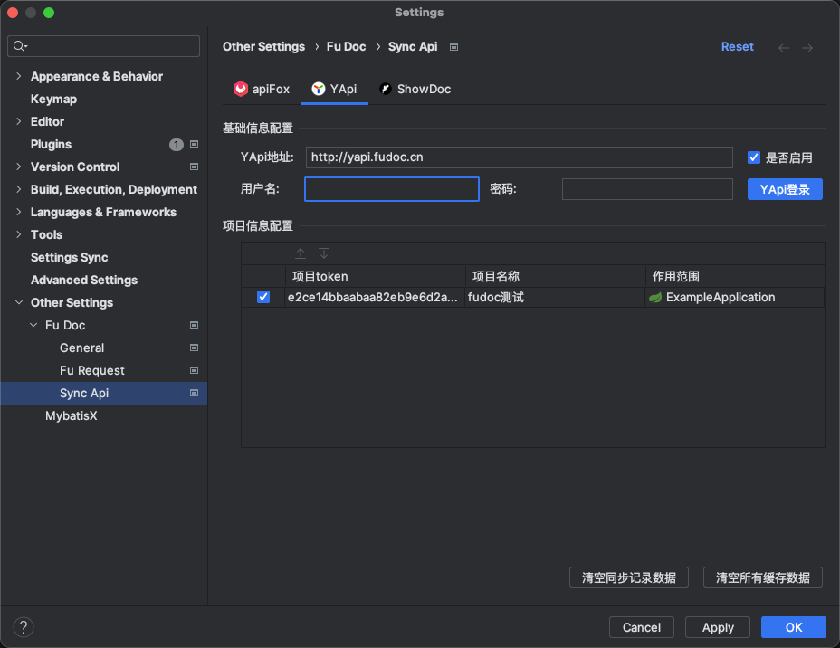

:::tip 概述
**[Fu Doc]支持将接口信息同步至YApi的指定目录中，如果你正在使用YApi作为你的文档系统，那么[Fu Doc]将会是你的一个比较好的选择**

**[Fu Doc]比`EasyYapi`插件有更友好的UI界面支持、支持同步自定义文档的说明信息至YApi，并且支持将请求的示例数据直接一并同步**

**当然`EasyYapi`是一个非常优秀的插件, 也有他自己的优点，此处不做赘述。<Badge text="萝卜青菜 个有所爱"/> 读者可自行选择**
:::

## 效果图

## 配置YApi

#### 配置说明

- **YApi地址：<Badge  type="error" text="必填"/>** 输入你们自己搭建的YApi服务地址
:::tip
可以使用`[Fu Doc]`提供的YApi服务`http://yapi.fudoc.cn`。<Badge  type="error" text="仅供测试使用, 不保证数据安全，请谨慎使用"/>
:::
- **是否启用：<Badge  type="error" text="必填"/>** 必须要勾选，勾选之后才认为需要同步文档至YApi
- **用户名、密码、YApi登录：** 当前暂未实现, 为正在规划的下一个大版本预留。
- **项目配置信息：<Badge  type="error" text="必填"/>** 用于配置当前项目的接口同步至YApi中的哪个项目, 正常情况只需要配置一个项目即可(如果你当前项目的接口对应YApi中的多个项目, 则可将对应的YApi项目都在此处配置)
- **项目token：<Badge  type="error" text="必填"/>** 在YApi的目标项目中获取。 可参考[点我查看获取YApi项目Token](/pages/52ab08)
- **项目名称：<Badge  type="error" text="必填"/>** 自动从YApi系统中获取回填
- **作用范围：<Badge  type="error" text="必填"/>** 选择当前哪一个项目下的接口同步至ApiFox的这个目标项目. 如果下拉框没有可选值[点我查看解决办法](/pages/047c9a)

:::danger 提醒
**配置完成后 <Badge  type="error" text="一定要点击OK按钮"/>才会持久化保存你的配置**
:::

## 同步文档至YApi
**在目标接口方法体内使用快捷键<Badge text="ALT+S"/>发起同步 如下图所示**

:::tip 温馨提示
- **[Fu Doc]会自动从YApi系统将当前项目所有的分类同步至接口分类下拉框中**
- **YApi只支持一级分类，不支持多级分类**
:::

#### 选择接口分类

- **项目名称：** YApi中的项目, 如果存在多个项目, 可以在此处选择你的目标项目
- **接口分类：** 实时同步YApi系统中的接口分类，如果没有你要同步的目标分类则需要手动创建一个分类<Badge  type="error" text="YApi仅支持一级分类"/>

#### 同步接口

**选择目标目录点击<Badge text="OK按钮"/>后 [Fu Doc]立即同步接口文档至YApi 会在右下角提示同步结果 如下图所示**

#### 同步记录

#### 进入YApi系统查看文档
**点击`去yapi查看文档`超链接即可自动跳转到yapi系统中 如下图所示 为接口同步至YApi系统的效果**

