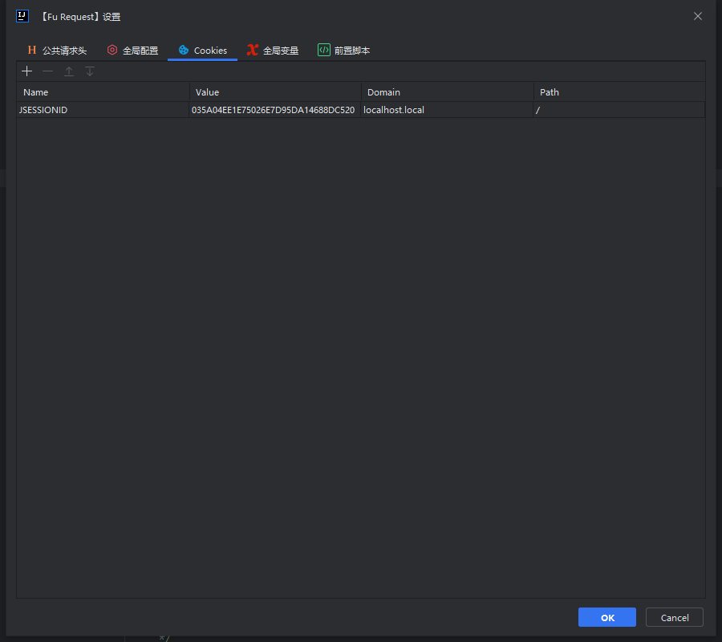
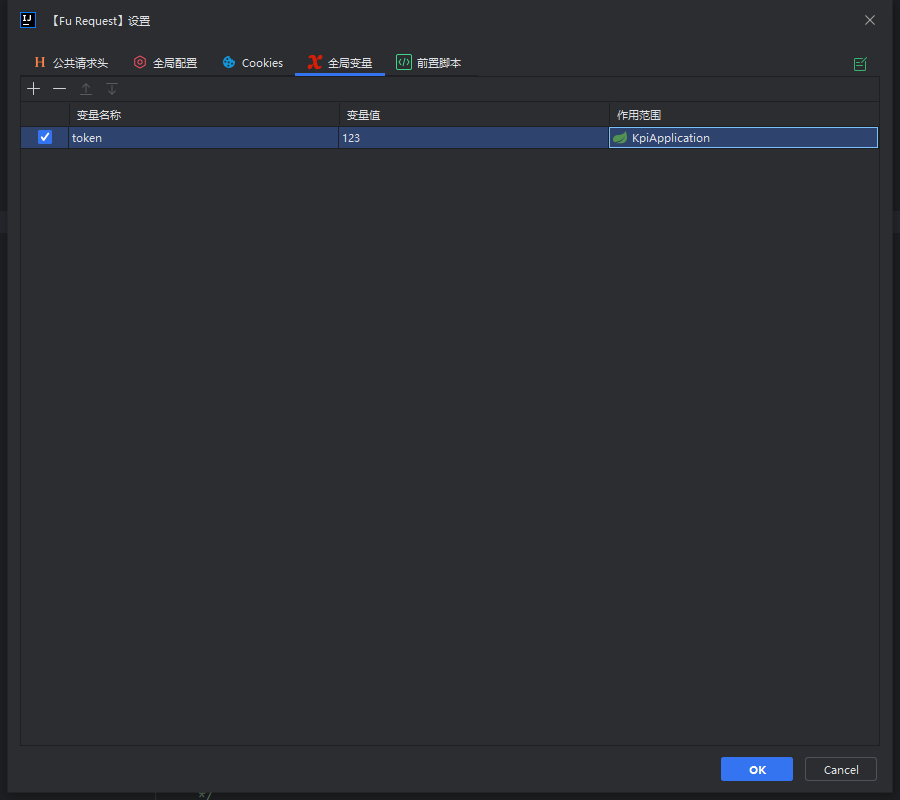

**如果你调试接口时，希望对**当前项目**所有的接口做一些统一的配置, 例如添加全局请求头、全局变量、切换接口请求环境、鉴权、前置脚本等。那么你可以在全局配置里通过一些简单的配置来达到你的目的**

:::tip 温馨提示
在请求窗体中所有的配置都可以通过<Badge text="fudoc.变量名"/>来引用变量 其中变量可以统一在**全局变量tab**中维护
:::

## 变量
**Fu Doc目前提供了三种类型的变量来支持在请求设置中直接引用**
- [全局变量](/pages/1c4152/)
- [环境变量](/pages/c97a7c/)
- [鉴权变量](/pages/41d694/)

## 请求设置界面

## 公共请求头
:::tip 温馨提示
支持使用全局变量和鉴权变量
:::

**如下图所示，在该界面新增请求头并选择作用范围(项目)保存之后, 在该范围下的所有接口都将会携带上这些请求头**

## 全局配置

**环境配置和用户鉴权配置都支持配置自定义表头，用户可以通过点击设置按钮来配置自定义的表头**
**如果你不知道自定义表头的作用 [点我查看自定义表头作用](/pages/f3d84e/)**

### 环境配置
:::tip
该配置的数据由**Fu Doc**自动读取项目配置文件生成, 在发起接口请求时. 会根据请求面板中选择的环境来获取对应的域名信息以此发起接口请求
:::

- 环境配置中的数据正常情况下用户无需新增, `Fu Doc`会在每次项目启动时读取项目的配置文件生成该数据.
- 如果默认生成的环境配置数据不满足你的使用, 你可以在此处配置你自己的环境信息（记得一定要关闭**自动读取Spring配置**）
- 如果环境配置中的数据不是最新的, 你可以点击表格工具栏上的刷新按钮来手动读取当前项目的配置

### 用户鉴权配置
:::tip
你可以在该配置下维护多个用户信息, 并配合前置脚本实时获取用户的token来实现快速切换不同的用户调试接口
:::

## Cookies

:::tip
该面板主要支持管理在实际请求中的一些Cookies, 包括执行前置脚本产生的Cookies
:::

## 全局变量

:::tip
全局变量主要用户维护一些变量, 经常配合前置脚本一起使用
:::

## 前置脚本