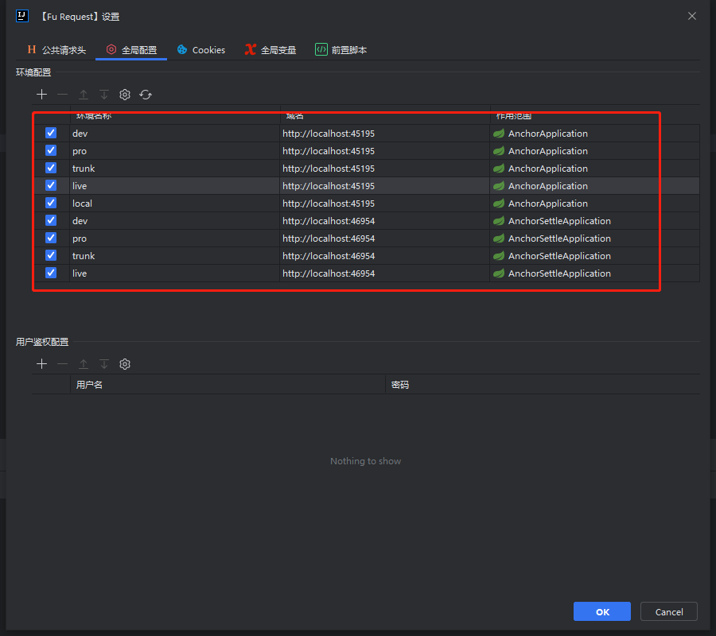
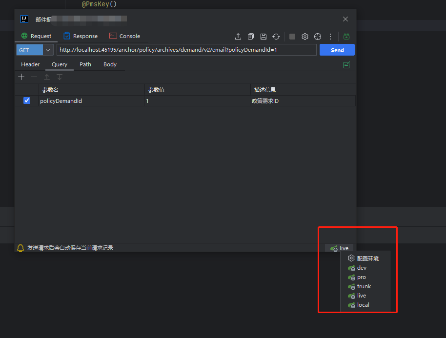

**环境切换支持用户在请求面板切换不同的环境, 本质上是切换接口请求的域名**

### 配置环境信息(打开项目时Fu Doc自动解析完成配置)
:::tip Tips
- **如果没有环境配置, 可手动点击刷新按钮手动加载配置**
- **也可以手动配置自己定义的环境信息**
:::

### 切换环境
**如下图所示 可以在请求面板中切换不同的环境, 切换后接口请求域名会跟随环境联动**
